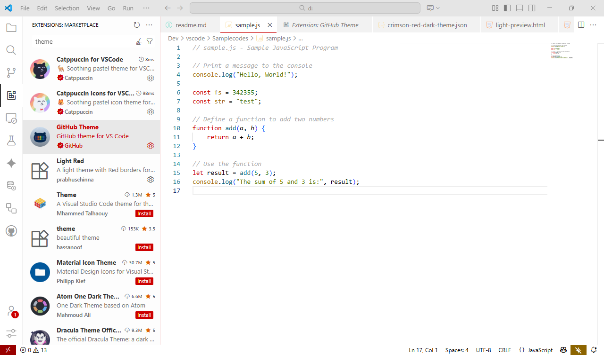
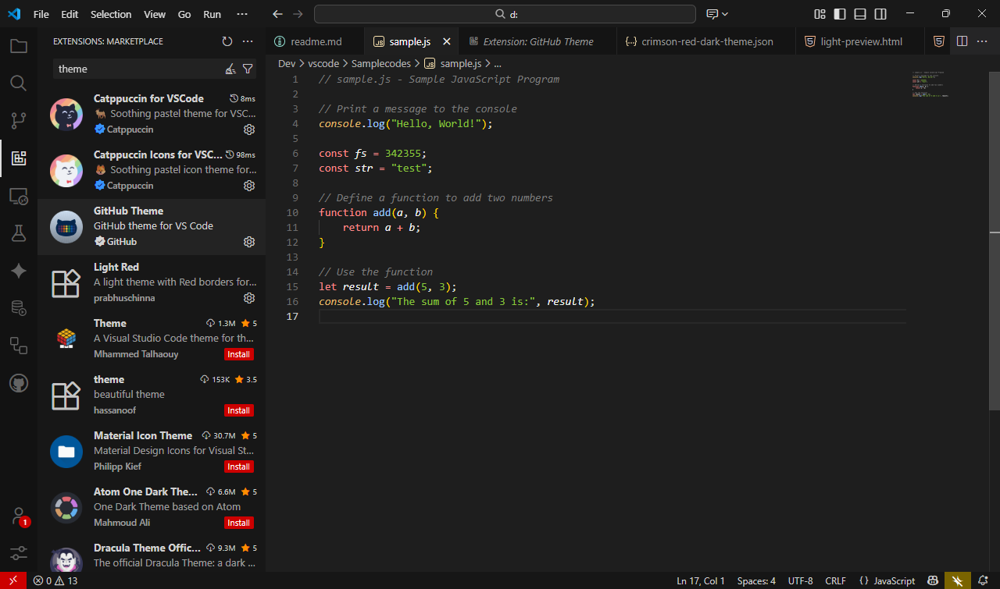

# Crimson Red

Crimson-accented light and dark themes for better readability and subtle accents.

## Preview

Light theme  


Dark theme  


For an up-to-date, interactive look at every variant (with JavaScript, XML and JSON samples,
and the regular vs. italic styling side by side), open the static previews in a browser:

- [preview/light-preview.html](preview/light-preview.html)
- [preview/dark-preview.html](preview/dark-preview.html)

> The screenshots above are captured in-editor; the HTML previews always reflect the current palette.

## Variants

Pick one from the Color Theme picker (`Ctrl/Cmd+K Ctrl/Cmd+T`):

- **Crimson Red Light**
- **Crimson Red Light Italic**
- **Crimson Red Dark**
- **Crimson Red Dark Italic**

The *Italic* variants add italics to comments, control-flow keywords, parameters and JSX/TSX attributes. The regular variants use no italics.

## Features
- Four variants: light / dark, each in regular and italic
- Crimson (`#cc0000`) accent for keywords and UI highlights
- Distinct yellow/gold editor selection
- Distinct coloring for XML/HTML (red tags, amber attributes) and JSON (teal keys vs. olive string values)
- Full terminal palette, git decorations, minimap, bracket-pair colors, inlay hints and other modern surfaces in both light and dark
- Carefully chosen neutrals for better contrast

## Development

All four themes are generated from a single source of truth so light and dark can't drift apart:

- Palette, workbench colors and syntax overrides live in [build-themes.js](build-themes.js)
- The shared syntax catalog lives in [src/token-colors.base.json](src/token-colors.base.json)
- Dark is derived from the light palette by role-based color substitution

Regenerate the theme files after editing either:

```
npm run build   # or: node build-themes.js
```